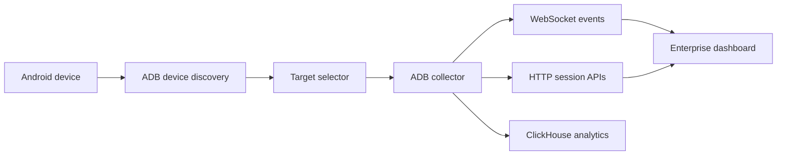

# Android Performance Observability

Feature Name: android-performance-observability
Updated: 2026-07-26

## Description

系统采用 ADB 开发设备诊断架构。采集器读取用户选择的设备和应用帧数据，服务端将数据聚合为会话和窗口指标，并写入 ClickHouse。

## Architecture

看板通过 ADB 设备发现接口列出在线设备与第三方应用。用户确认目标后，采集器仅从该设备和包名读取帧统计，并通过 HTTP 和 WebSocket 提供会话数据。

## Components and Interfaces

- **ADB device discovery**: 查询已连接设备及每个设备的第三方应用包名。
- **Target selector**: 校验并保存用户选择的设备和包名，作为采集目标。
- **ADB collector**: 以单次串行轮询采集选中设备、选中包名的刷新率和 `gfxinfo` 帧数据。
- **Frame data parser**: 同时解析旧版 `Profile data in ms` 与 `framestats` 的 `---PROFILEDATA---` 数据，并记录格式、数据行与有效帧计数。
- **Session aggregator**: 计算帧预算、卡顿率、冻结帧、平均值和分位数，保留趋势和风险事件。
- **Session API**: 提供 `/api/health`、`/api/sessions` 与 `/api/sessions/:id`。
- **Target API**: 提供 `/api/devices`、`/api/devices/:id/packages` 与 `/api/collector/connect`。
- **Diagnostics API**: 提供 `/api/diagnostics`，并通过 `diagnostic-event` 推送连接和采样日志。
- **Dashboard**: 在采集目标连接成功后重建 WebSocket，订阅事件并在浏览器控制台输出连接、关闭和采集异常诊断信息。
- **ClickHouse adapter**: 在配置 `PERFORMANCE_CLICKHOUSE_URL` 后将每个性能窗口写入 `performance.performance_windows`。

## Data Models

- **PerformanceWindow**: 会话 ID、时间、FPS、刷新率、帧预算、总帧数、卡顿帧数、冻结帧数、平均值、p95、p99、卡顿率。
- **PerformanceSession**: 会话 ID、设备 ID、包名、刷新率、开始时间、最新窗口、累计指标和最近趋势。
- **PerformanceIncident**: 会话 ID、严重等级、时间、原因、帧耗时和可选线程堆栈。
- **DiagnosticEntry**: 日志 ID、时间、等级、事件描述和关联的设备或包名信息。

## Correctness Properties

- 每个轮询周期仅允许一个 ADB 采集任务运行。
- 每个轮询周期仅使用当前已连接目标的设备 ID 和包名。
- 诊断日志按时间倒序保留最近 80 条。
- 每个性能窗口的卡顿率等于卡顿帧数除以总帧数。
- 帧预算等于 1000 除以当前刷新率。
- 分位数从当前窗口的全部有效帧耗时计算。

## Error Handling

- ADB 不可用时，健康接口返回不可用状态，看板保留最后一次有效会话数据。
- 帧数据格式缺失时，采集器跳过该窗口并保留服务进程。
- 堆栈采集失败时，风险事件携带采集失败信息。
- ClickHouse 未配置或暂时不可用时，服务端保留内存会话并继续推送实时事件。

## Test Strategy

- 对帧解析、分位数、帧预算和卡顿判断编写单元测试。
- 使用模拟 ADB 输出验证设备发现、应用选择和采集失败处理。
- 验证前端可处理空会话、实时窗口与风险事件。

## References

[^1]: [Android dumpsys performance data](https://developer.android.com/tools/dumpsys)
[^2]: [Android Perfetto tracing](https://developer.android.com/tools/perfetto)
