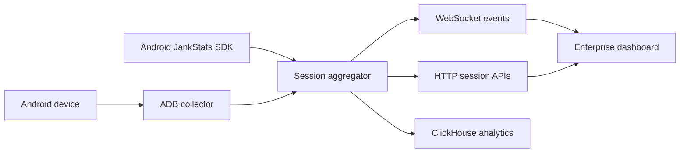

# Android Performance Observability

Feature Name: android-performance-observability
Updated: 2026-07-25

## Description

系统采用“应用内指标采集 + 开发设备诊断”的双通道架构。Android SDK 使用 JankStats 在应用内聚合帧数据；ADB 采集器服务于开发设备即时诊断；服务端将两个来源标准化后写入 ClickHouse。

## Architecture

开发设备通过 ADB 输出帧统计。服务端将帧统计转换为会话和窗口指标，并通过 HTTP 和 WebSocket 提供给看板。后续 Android SDK 可直接向聚合层提交同一事件模型。

## Components and Interfaces

- **ADB collector**: 以单次串行轮询采集前台包名、刷新率和 `gfxinfo` 帧数据。
- **Session aggregator**: 计算帧预算、卡顿率、冻结帧、平均值和分位数，保留趋势和风险事件。
- **Session API**: 提供 `/api/health`、`/api/sessions`、`/api/sessions/:id` 与 `/api/ingest/windows`。
- **Dashboard**: 订阅 `performance-event`、`incident-event` 与 `stack-event`，呈现会话概览、趋势与事件上下文。
- **Android SDK**: 以 10 秒窗口聚合 JankStats 帧耗时并异步提交 JSON 性能窗口。
- **ClickHouse adapter**: 在配置 `PERFORMANCE_CLICKHOUSE_URL` 后将每个性能窗口写入 `performance.performance_windows`。

## Data Models

- **PerformanceWindow**: 会话 ID、时间、FPS、刷新率、帧预算、总帧数、卡顿帧数、冻结帧数、平均值、p95、p99、卡顿率。
- **PerformanceSession**: 会话 ID、数据来源、设备 ID、包名、应用版本、Android 版本、页面、刷新率、开始时间、最新窗口、累计指标和最近趋势。
- **PerformanceIncident**: 会话 ID、严重等级、时间、原因、帧耗时和可选线程堆栈。

## Correctness Properties

- 每个轮询周期仅允许一个 ADB 采集任务运行。
- 每个性能窗口的卡顿率等于卡顿帧数除以总帧数。
- 帧预算等于 1000 除以当前刷新率。
- 分位数从当前窗口的全部有效帧耗时计算。

## Error Handling

- ADB 不可用时，健康接口返回不可用状态，看板保留最后一次有效会话数据。
- 帧数据格式缺失时，采集器跳过该窗口并保留服务进程。
- 堆栈采集失败时，风险事件携带采集失败信息。
- ClickHouse 未配置或暂时不可用时，服务端保留内存会话并继续推送实时事件。
- Android SDK 网络不可用时，SDK 将窗口写入本地队列并在后续成功请求时按顺序提交。

## Test Strategy

- 对帧解析、分位数、帧预算和卡顿判断编写单元测试。
- 使用模拟 ADB 输出验证应用切换和采集失败处理。
- 验证前端可处理空会话、实时窗口与风险事件。

## References

[^1]: [Android dumpsys performance data](https://developer.android.com/tools/dumpsys)
[^2]: [Android Perfetto tracing](https://developer.android.com/tools/perfetto)
